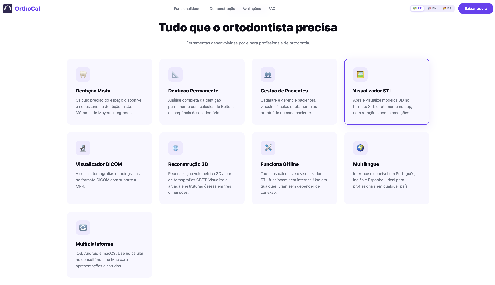

# 🦷 OrthoCal — Dental Analyses

> App de análise ortodôntica completo para ortodontistas. Análises de Bolton, Wolford e Moyers, visualização 3D de arquivos STL/DICOM/CBCT e gerenciamento de pacientes — tudo em um só lugar.

🌐 **Prévia do site:** [sitedc.online/orthocal](https://sitedc.online/orthocal)

---

## 📱 Sobre o app

OrthoCal é um aplicativo Flutter multiplataforma voltado para ortodontistas, com foco em análises clínicas precisas e visualização de modelos 3D diretamente no celular ou desktop.

Usado por profissionais em **+15 países**.

---

## ✨ Funcionalidades

- **Análise de Bolton** — proporção anterior e total
- **Análise de Wolford** — avaliação cefalométrica
- **Análise de Moyers** — previsão de caninos e pré-molares
- **Visualização STL 3D** — carregamento, medição e manipulação de modelos dentários
- **Suporte a DICOM/CBCT** — arquivos de tomografia
- **Gerenciamento de pacientes** — histórico e registros clínicos
- **Offline-first** — funciona sem internet
- **Multilíngue** — Português, Inglês e Espanhol
- **Tema claro/escuro**

---

## 🛠️ Tecnologias

| Camada | Tecnologia |
|---|---|
| Mobile | Flutter · Dart |
| Arquitetura | Clean Architecture · MVVM |
| Estado | Provider · Riverpod |
| Backend | Firebase Firestore · Firebase Auth |
| 3D | OpenGL / Flutter 3D rendering |
| CI/CD | GitHub Actions |
| Lojas | Google Play · Apple App Store · Microsoft Store |

---

## 📦 Plataformas

- ✅ Android (Play Store)
- ✅ iOS (App Store)
- ✅ macOS
- ✅ Windows (Microsoft Store)

---

## 🔗 Links

| | |
|---|---|
| 🌐 Site oficial | [sitedc.online/orthocal](https://sitedc.online/orthocal) |
| 📱 Play Store | [Download Android](https://play.google.com/store/apps/details?id=com.dorcaschagas.calculadora) |
| 🍎 App Store | [Download iOS](https://apps.apple.com/br/app/orthocal/id6636519508) |
| 👩‍💻 Desenvolvedora | [sitedc.online](https://sitedc.online/configurar-ambiente/sobre/index.html) |

---

> Desenvolvido por [Dorcas Chagas](https://sitedc.online/configurar-ambiente/sobre/index.html) · Software DC
